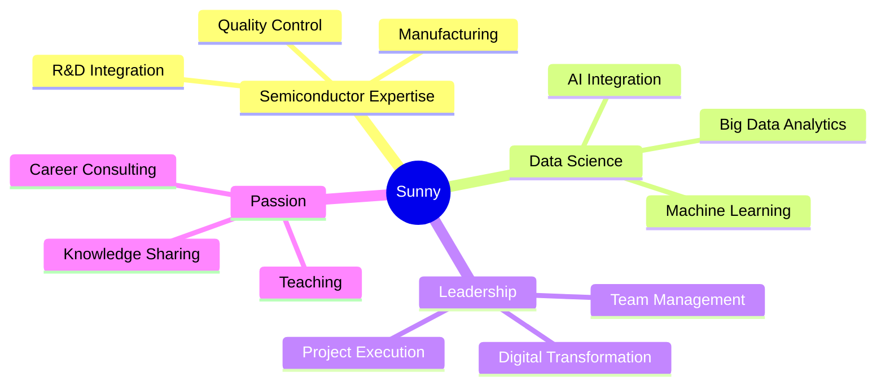

<div align="center">

# 👋 Hi, I'm Sunny | 桑尼資料科學 > 你的學伴 ⚡


[](https://www.linkedin.com/in/wei-yang-weng-13b71215b/)
[](https://www.instagram.com/datasunnie)
[](mailto:xdxd2455789@gmail.com)

</div>


<div align="center">


*🤖 Powered by Runway | Creative Tech Showcase*

</div>

---

## 💫 About Me

```python
class DataAlchemist:
    def __init__(self):
        self.name = "Sunny"
        self.role = "Data Scientist & AI Engineer"
        self.background = {
            "semiconductor": "6+ years R&D integration",
            "data_science": "4+ years EDA & Smart Manufacturing",
            "teaching": "10 years sharing knowledge & career consulting"
        }
        self.mindset = "Theory-driven, Engineering-rooted 🌱"

    def expertise(self):
        return [
            "🏭 0-to-1 Product Development & Mass Production",
            "🔧 Factory Setup to Operations (Full Lifecycle)",
            "📊 Data Mining under Extreme Pressure",
            "👥 3-5 Team Management & Project Leadership",
            "💡 Systematic Solutions via Domain Knowledge + Data Science"
        ]

    def passion(self):
        return "Helping lost souls find their passion 🔥"
```

---

## 🛠️ Tech Stack | 技術棧

<div align="center">

### 💻 Programming Languages


### 🤖 AI & Machine Learning


### 📊 Data Analysis & Processing


### 📈 Visualization & BI


### ☁️ Cloud & Big Data


### 🔧 DevOps & MLOps


### 🗄️ Database & Storage


### 🏭 Specialized Tools


</div>

---

## 📈 GitHub Stats

<div align="center">


</div>

<div align="center">


</div>

---

## 🎯 Key Highlights

<table>
<tr>
<td width="50%">

### 🏭 Industrial Experience
- ✅ 6 years semiconductor R&D integration
- ✅ Full factory lifecycle: setup → operation
- ✅ 0-to-1 product development & mass production
- ✅ Smart manufacturing transformation

</td>
<td width="50%">

### 🚀 Technical Leadership
- ✅ 4+ years data analysis & EDA
- ✅ Team management (3-5 members)
- ✅ Project management & cross-functional collaboration
- ✅ AI/ML integration in production

</td>
</tr>
</table>

---

## 🌟 What I Bring to the Table



---

## 🎓 Teaching & Mentoring

> **10 years** of education experience | Helping professionals find their passion

- 📚 Technical training & workshops
- 💼 Career consulting & guidance
- 🌱 Helping lost souls discover their direction
- 🔥 Igniting passion in data science & AI

---

## 📫 Let's Connect!

<div align="center">

**🌟 Open to collaboration, consulting, and sharing knowledge! 🌟**

💌 **來信合作：** xdxd2455789@gmail.com

[](https://www.linkedin.com/in/wei-yang-weng-13b71215b/)
[](https://www.instagram.com/datasunnie)
[](mailto:xdxd2455789@gmail.com)

---

*"From theory to practice, from 0 to 1, making ideas happen!"* 💡


</div>
